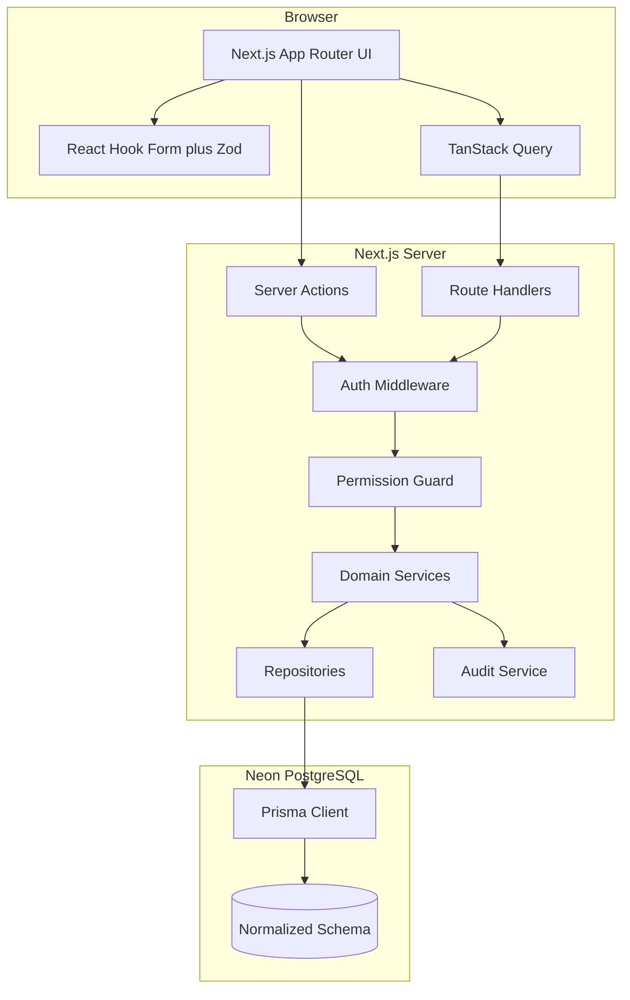
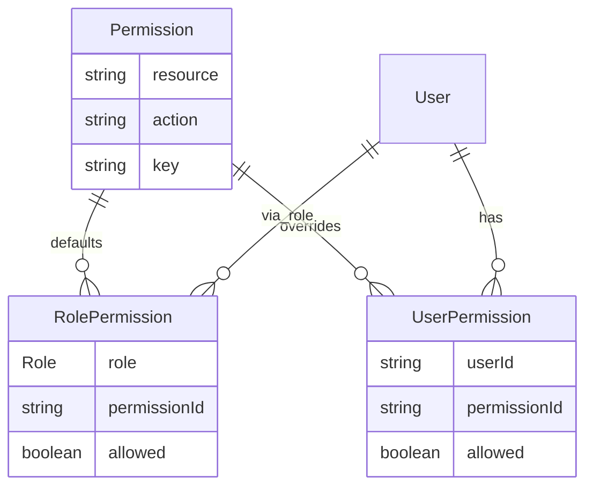
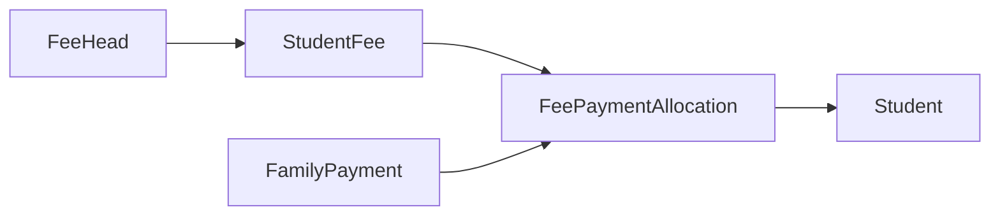

# School ERP — Production Architecture Plan

## Locked decisions

| Decision | Choice |
|---|---|
| Delivery | Phase 1 core + Fee Module + Payment Allocation first; remaining modules follow in order; **no module from the master spec is omitted** |
| Database | Neon PostgreSQL (`DATABASE_URL` pooled + `DIRECT_URL` for migrations) |
| Teachers | Login role with **configurable RBAC** (same model as Accountant; Principal assigns/revokes) |
| Auth | Better Auth (email/password) + Prisma adapter |
| Runtime | Next.js 15 App Router only (Route Handlers + Server Actions); Vercel deploy |
| Files | Document binaries stored in PostgreSQL (`BYTEA`), not object storage |
| Multi-school | `School` table + required `schoolId` on tenant data from day one (single seeded school now) |

---

## System architecture



**Layer rules (non-negotiable):**

- UI never talks to Prisma directly.
- Business rules live in **services** (`src/server/services/*`).
- Persistence lives in **repositories** (`src/server/repositories/*`) when queries are non-trivial; simple CRUD can stay in services via Prisma transactions.
- Zod schemas in `src/server/validators/*` validate every mutation/query input.
- Permissions checked in a single `requirePermission()` guard before service execution.
- Audit writes happen inside the same DB transaction as the mutating operation where possible.

---

## Folder structure (complete before feature code)

```
/
├── prisma/
│   ├── schema.prisma              # Full domain + Better Auth models
│   ├── migrations/
│   └── seed.ts                    # School + Principal + permission catalog + role defaults
├── src/
│   ├── app/
│   │   ├── (auth)/login/
│   │   ├── (dashboard)/           # Authenticated shell
│   │   │   ├── layout.tsx         # Sidebar, session, theme
│   │   │   ├── dashboard/
│   │   │   ├── admissions/
│   │   │   ├── students/
│   │   │   ├── families/
│   │   │   ├── classes/
│   │   │   ├── attendance/
│   │   │   ├── academics/         # Sessions, promotion, leave
│   │   │   ├── examinations/
│   │   │   ├── fees/
│   │   │   ├── documents/
│   │   │   ├── reports/
│   │   │   ├── notices/
│   │   │   └── settings/          # Users, permissions, backup, import
│   │   ├── api/
│   │   │   ├── auth/[...all]/
│   │   │   ├── search/
│   │   │   ├── export/
│   │   │   ├── import/
│   │   │   ├── documents/[id]/
│   │   │   └── backup/
│   │   ├── layout.tsx
│   │   └── globals.css
│   ├── components/
│   │   ├── ui/                    # shadcn
│   │   ├── layout/                # Sidebar, Header, GlobalSearch
│   │   ├── data-table/            # TanStack Table wrappers
│   │   ├── forms/
│   │   └── shared/                # Empty/Loading/Error/Confirm/PageHeader
│   ├── server/
│   │   ├── auth/                  # session helpers, role helpers
│   │   ├── permissions/           # catalog, guard, resolveEffectivePermissions
│   │   ├── repositories/
│   │   ├── services/              # one file/module group per domain
│   │   ├── validators/
│   │   └── lib/                   # prisma, excel, pdf, crypto, audit helpers
│   ├── hooks/                     # TanStack Query hooks
│   ├── types/
│   ├── config/                    # navigation, permission keys, constants
│   └── middleware.ts              # session gate for /dashboard routes
├── .env.example
├── package.json
└── README.md
```

---

## Authentication and roles

**Roles (enum):** `PRINCIPAL` | `ACCOUNTANT` | `TEACHER` | `STUDENT`

| Role | Access model |
|---|---|
| Principal | Full control; manages users; assigns/revokes permissions for Accountant and Teacher |
| Accountant | Starts with fee/admission defaults; Principal can grant/revoke any catalog permission |
| Teacher | Starts with attendance/marks/class defaults; Principal can grant/revoke any catalog permission |
| Student | Hard-scoped **read-only** to own student record (and linked family/fees/results); cannot receive write permissions |

Better Auth tables (`user`, `session`, `account`, `verification`) extend with app fields on `user`: `role`, `isActive`, `schoolId`, optional `staffProfileId` / `studentId`.

Bootstrap: seed creates one `School`, one Principal user (credentials from env: `SEED_PRINCIPAL_EMAIL` / `SEED_PRINCIPAL_PASSWORD`). No fake demo students/fees.

---

## RBAC design (before modules)



**Permission key format:** `{resource}.{action}`  
Actions: `view` | `create` | `update` | `delete` | `export` | `import` | `approve`

**Resources (catalog seeded, not hardcoded in UI):**  
`dashboard`, `session`, `admission`, `student`, `family`, `class`, `section`, `subject`, `attendance`, `leave`, `exam`, `marks`, `result`, `fee`, `payment`, `document`, `report`, `notice`, `user`, `permission`, `audit`, `backup`, `import`, `settings`

**Resolution order:**

1. If role = `STUDENT` → apply student data-scope policy (read own only); ignore grant of write actions.
2. Else resolve effective map = RolePermission defaults ⊕ UserPermission overrides (user override wins).
3. Principal always passes all checks (still audited).

UI sidebar and buttons use the same effective permission map. API/Server Actions always re-check server-side.

---

## Complete PostgreSQL schema (normalized, multi-school ready)

Every business table includes: `id` (cuid), `createdAt`, `updatedAt`, and where tenant-scoped: `schoolId` → `School`.

### Identity and access
- `School` — name, code, address, settings JSON
- Better Auth: `User`, `Session`, `Account`, `Verification`
- `Permission`, `RolePermission`, `UserPermission`
- `StaffProfile` — for Principal/Accountant/Teacher (name, phone, employeeCode, designation)
- `AuditLog` — userId, action, entityType, entityId, oldValue JSON, newValue JSON, ip, userAgent, createdAt

### Academic structure
- `AcademicSession` — name, startDate, endDate, status (`DRAFT`|`ACTIVE`|`CLOSED`|`ARCHIVED`), isCurrent
- `Class` — name, sortOrder
- `Section` — classId, name
- `Subject` — name, code
- `ClassSubject` — classId, subjectId, sessionId
- `ClassTeacherAssignment` — sectionId, staffProfileId, sessionId (unique per section/session)

### Family and students
- `Family` — fatherName, motherName, guardianName, phones, address fields
- `Student` — familyId, admissionNo (unique per school), userId (optional login), DOB, gender, bloodGroup, aadhaar (encrypted/hashed display policy), status
- `StudentEnrollment` — studentId, sessionId, classId, sectionId, rollNo, status
- `StudentMedical` — studentId, allergies, conditions, notes
- `StudentSibling` derived via shared `familyId` (no duplicate sibling table required; optional `SiblingLink` only if non-family siblings needed — **not used**; siblings = same family)
- `PromotionHistory` — studentId, fromSession/Class/Section → toSession/Class/Section, promotedAt, byUserId

### Admissions
- `AdmissionApplication` — sessionId, family draft fields or familyId, status (`PENDING`|`APPROVED`|`REJECTED`), appliedClassId, documents, reviewedBy, admissionNo generated on approve
- Approval creates/links `Student` + `StudentEnrollment` + optional student user in one transaction

### Attendance and leave
- `AttendanceRecord` — sessionId, studentId, date, status (`PRESENT`|`ABSENT`|`LATE`|`HALF_DAY`|`EXCUSED`), markedBy
- Unique `(studentId, date)`
- `LeaveRequest` — studentId or staffProfileId, from/to, reason, status, approvedBy

### Examinations
- `ExamType` — name (Unit/Mid/Final), sessionId
- `Exam` — examTypeId, classId, start/end
- `ExamSubject` — examId, subjectId, maxMarks, passMarks
- `MarkEntry` — examSubjectId, studentId, marksObtained, grade, enteredBy
- `GradeScale` — schoolId, min%, max%, grade, remarks
- `ReportCard` — generated metadata + snapshot JSON for immutability after publish

### Fees and payment allocation (critical path)


- `FeeHead` — name, frequency, optional class mapping
- `FeeStructure` / `FeeStructureItem` — per session/class amounts
- `StudentFee` — studentId, feeHeadId, sessionId, amount, dueDate, status
- `FamilyPayment` — familyId, amount, method (`CASH`|`UPI`|`CHEQUE`|`BANK_TRANSFER`), referenceNo, paidAt, receiptNo (unique), recordedBy, notes
- `FeePaymentAllocation` — paymentId, studentId, studentFeeId (nullable for advance), amount  
  Constraint: sum(allocations.amount) = payment.amount (enforced in service transaction)
- `FeeReceipt` — printable snapshot tied to payment

### Documents (Postgres binary storage)
- `Document` — ownerType (`STUDENT`|`FAMILY`|`ADMISSION`|`STAFF`), ownerId, type (`BIRTH_CERTIFICATE`|`AADHAAR`|`TRANSFER_CERTIFICATE`|`MEDICAL_CERTIFICATE`|`PHOTO`|`OTHER`), fileName, mimeType, sizeBytes, checksum
- `DocumentBlob` — documentId (1:1), `data Bytes`  
  Max size enforced in service (e.g. 5MB). Serve via authenticated Route Handler streaming; never public URLs.

### Notifications
- `Notice` — title, body, audience, publishedAt, createdBy
- `NotificationChannel` stub enum/table for future `SMS`|`WHATSAPP`|`EMAIL` (no providers wired yet)

### Import / backup
- `ImportJob` — type, status, successCount, failCount, errorReport JSON, uploadedBy
- `BackupJob` — type (`EXPORT`|`RESTORE`), status, file metadata / blob reference, createdBy

### Indexes (representative)
- Student: `(schoolId, admissionNo)`, `(schoolId, fullName)`, family phones
- Attendance: `(studentId, date)`, `(sectionId, date)` via enrollment join
- Payment: `(schoolId, receiptNo)`, `familyId`
- Audit: `(entityType, entityId)`, `createdAt`
- Global search: trigram/ILIKE indexes on name, admissionNo, phone, receiptNo (Prisma + raw SQL migration where needed)

---

## Cross-cutting platform features

- **Global search** (`/api/search`): permission-filtered results for student name, admission no, phone, father/mother name, class, receipt no
- **Data tables**: shared pagination, sort, filter, search; loading/empty/error states
- **Excel import**: template download + validate-then-import for Students, Teachers (Staff), Classes, Subjects; return success/fail rows; invalid rows skipped
- **Reports**: real aggregates only (no fake charts); Excel + PDF export via Route Handlers
- **Audit**: wrap mutating services
- **Backup**: SQL dump export/import via secured Principal-only API (pg_dump-compatible logical export of critical tables as JSON/SQL archive stored temporarily as blob or streamed download)
- **Dark mode**: next-themes + shadcn
- **UI**: premium minimal professional; shadcn; responsive sidebar; cards for interactive surfaces; toasts + confirm dialogs

---

## Security

- Zod validation on all inputs
- Prisma parameterized queries (SQL injection resistance)
- XSS: React escaping + sanitize rich notice content if HTML allowed (prefer Markdown/plain)
- CSRF: Better Auth cookie/session patterns; mutations via Server Actions / same-site cookies
- Route protection: middleware session check + server permission guards
- Student isolation: repository queries always constrain `studentId = session.studentId`
- Document access: ownership + permission check before blob read
- Secrets only in env; never commit `.env`

---

## Implementation phases (all modules included)

### Phase 0 — Foundation (blocks everything)
1. Scaffold Next.js 15 + TS + Tailwind + shadcn + TanStack Query/Table + RHF + Zod
2. Neon env wiring + Prisma client singleton (pooled URL)
3. **Write complete Prisma schema** (all modules above) + initial migration
4. Better Auth login + middleware
5. Permission catalog seed + RolePermission defaults + `requirePermission`
6. App shell: sidebar (all nav items), header, global search stub wired to API, theme, shared UI primitives
7. Settings: user management + permission assignment UI for Principal

### Phase 1 — Core academics + people
- Academic Session (create/close/switch/archive/promote)
- Classes / Sections / Subjects / Class Teacher
- Families + Students (full profile sections: family, guardian, medical, documents meta, siblings, promotion/fee history panels)
- Role dashboards (real counts from DB; empty states when zero — **no fake charts**)
- Staff profiles for Teacher/Accountant

### Phase 2 — Revenue path (your 1B priority)
- Fee heads / structures / student fees
- Offline FamilyPayment + split allocations across siblings
- Receipt generation + payment history
- Accountant defaults exercised end-to-end

### Phase 3 — Admissions + attendance + leave
- Admission workflow + admission number generation + document upload
- Daily/monthly attendance + reports
- Leave request/approval/history

### Phase 4 — Examinations + documents
- Exam types, marks entry, grades, results, report cards
- Document upload/download from PostgreSQL blobs for all owner types
- Student ID card view/print

### Phase 5 — Reports, import, notifications, audit, backup
- All report types + Excel/PDF export
- Excel import templates + validation UI
- Notice board (+ channel architecture stubs)
- Audit log viewer
- Backup export/restore

Each phase ships production-quality UI states (validation, loading, empty, error, confirm) and integrates through the shared services/schema — no isolated silos.

---

## Environment (`.env.example`)

```
DATABASE_URL=           # Neon pooled
DIRECT_URL=             # Neon direct
BETTER_AUTH_SECRET=
BETTER_AUTH_URL=http://localhost:3000
SEED_PRINCIPAL_EMAIL=
SEED_PRINCIPAL_PASSWORD=
```

---

## Definition of done (commercial bar)

- Strict TypeScript throughout
- No placeholder business logic, no fake dashboard metrics
- Every listed module present and integrated
- Permissions enforced server-side
- Schema supports adding schools without redesign
- Vercel-deployable single Next.js app + Neon
